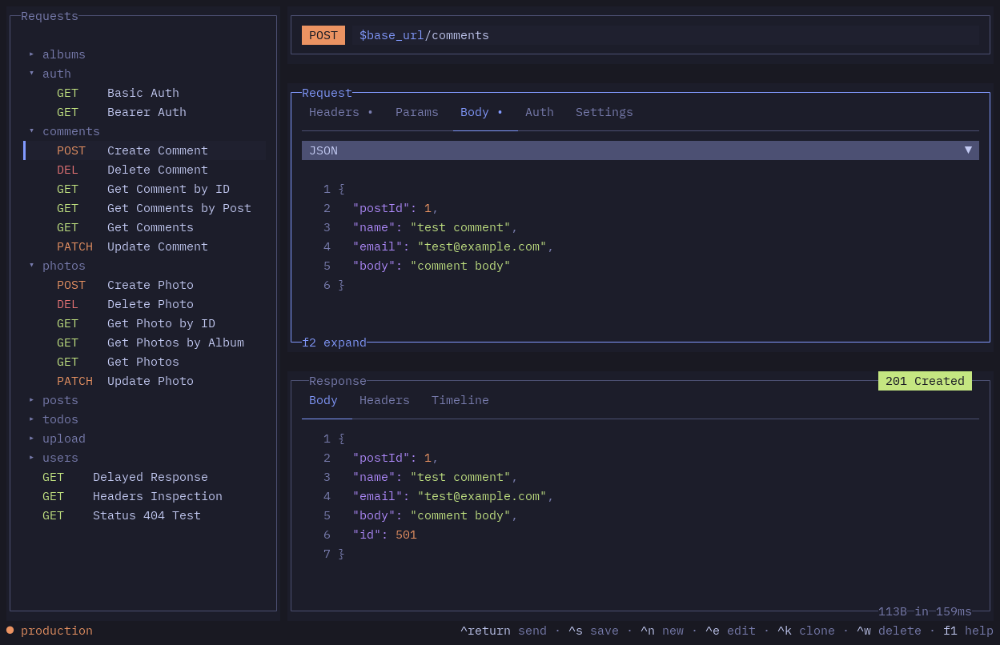

# noodle

A delicious REST client that lives in your terminal.

Noodle is an HTTP client, not unlike Postman and Bruno. As a TUI application, it can be used over SSH and enables efficient keyboard-centric workflows. Your requests are stored locally as simple YAML files — easy to read, easy to version control.



Some notable features include:

- YAML request files — one per request, git-friendly, no lock-in
- Folder organization with inheritable headers and auth
- Environments with `$var` substitution
- Inline editing of every field directly in the terminal
- Multiple auth types (bearer, basic, API key) and body types (JSON, form data, multipart, binary)
- Response history with timeline per request
- Theme picker and flexible layout (stacked / side-by-side)
- Customizable keybindings
- Import from OpenAPI 3.0 and Postman collections
- Copy response body to clipboard

## Installation

```bash
bun install
bun run dev -- --collection ./collections --env development
```

## Usage

Requests are `.yml` files, one per request:

```yml
name: Create Post
method: POST
url: $base_url/posts
headers:
  Content-Type: application/json
auth:
  type: bearer
  token: $api_token
body_type: json
body: |-
  {
    "title": "hello",
    "body": "world",
    "userId": 1
  }
```

Environments are `.env` files in `.environments/`:

```env
_color=success
base_url=https://jsonplaceholder.typicode.com
api_token=dev-token-123
```

`$var` values in requests are replaced from the active environment at send time. Cycle environments at runtime with `Ctrl+P`.

## Development

```bash
bun install
bun run dev -- --collection ./collections --env development
bun test
bun run lint
bun run typecheck
bunx prettier --check ./src ./tests
```
