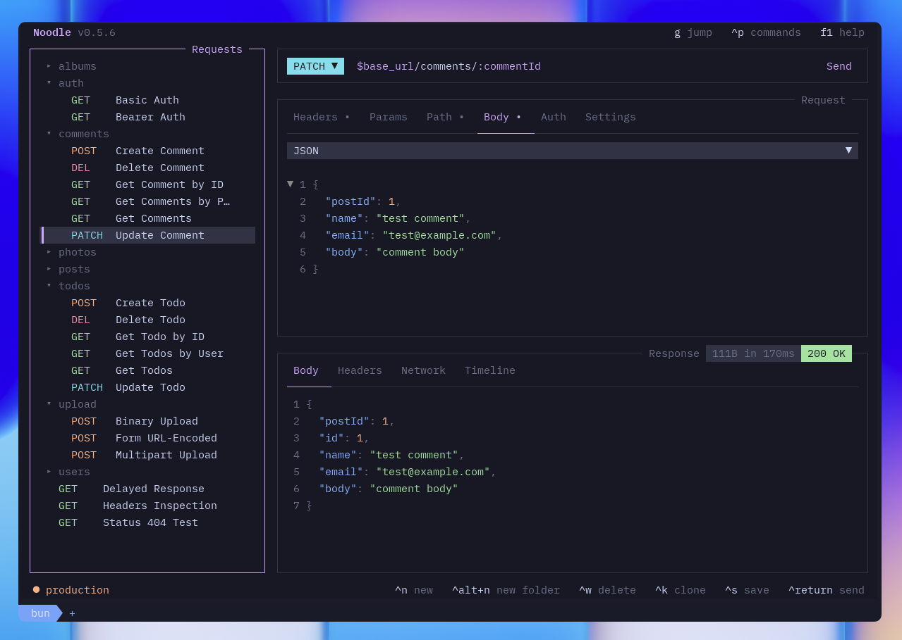

#  noodle

A delicious REST client that lives in your terminal.

Noodle is an HTTP client. As a TUI application, it can be used over SSH and enables efficient keyboard-centric workflows. Your requests are stored locally as simple YAML files, easy to read, easy to version control.



<p align="center">
  <a href="https://noodlerest.dev/">Website</a> ·
  <a href="https://noodlerest.dev/changelog/">Changelog</a> ·
  <a href="https://noodlerest.dev/roadmap/">Roadmap</a> ·
  <a href="https://noodlerest.dev/docs/getting-started/quick-start/">Quick Start</a> ·
  <a href="https://noodlerest.dev/docs/">Docs</a>
</p>

Some notable features include:

- 📁 One YAML file per request, git-friendly, no lock-in
- 🗂️ Folder organization with inheritable headers and auth
- 🌐 Environments with `$var` substitution
- ✏️ Built-in environment editor
- ⌨️ Inline editing of every field directly in the terminal
- 🔐 Multiple auth types (bearer, basic, API key) and body types (JSON, form data, multipart, binary)
- 📜 Response history with timeline per request
- ↔️ Layout switcher (stacked / side-by-side)
- 🎨 Theme picker with 30+ built-in themes
- 🛠️ Customizable keybindings
- 📦 Import from OpenAPI 3.0 and Postman collections
- 📋 Copy response body to clipboard

## Installation (macOS & Linux)

### Curl

```bash
curl -LsSf https://noodlerest.dev/install.sh | sh
```

### Homebrew

```bash
brew tap wilfredinni/noodle
brew trust wilfredinni/noodle
brew install noodle
```

Installs to `~/.local/bin/noodle` (curl) or your Homebrew prefix. Make sure the install directory is in your PATH.

### npx skills (AI agents)

Teach your AI coding agent to create, organize, audit, import, and convert noodle collections. Supports OpenCode, Claude Code, Cursor, Copilot, and 70+ other agents.

```bash
npx skills add wilfredinni/noodle --skill noodle-use -g
```

Example prompts:

- "Scaffold a noodle collection for the Stripe API with auth and a few endpoints"
- "Audit my collection for security issues and REST best practices"
- "Convert this Insomnia export to a noodle collection"
- "Change the expand layout keybinding to Alt+I"
- "Set Catppuccin as my theme"
- "How many requests are in the Stripe API collection?"
- "What's the average response time for the login request on my Stripe collection?"
- "Order the folders on the Stripe collection from Z to A"
- "Set up basic auth on the Posts folder for $basic_user and $basic_password"

## Roadmap

See the [public roadmap](https://app.notion.com/p/39128d9edba9809da834f351332baf57?v=39228d9edba98042ad07000cdbe5d751&source=copy_link) for upcoming features and improvements.

## Importing collections

Import requests from OpenAPI 3.0 specs or Postman collections:

```bash
noodle import ./specs/api.yaml
```

## Automation CLI

`noodle` without a subcommand remains the interactive TUI. Use the automation commands in scripts and agent workflows; collection paths are filesystem paths and request IDs are collection-relative paths without `.yml`.

Open a collection explicitly with a positional path or `--collection`:

```bash
noodle .
noodle --collection ./collections --env development
```

Without either option, noodle uses the first existing collection registered in `~/.config/noodle/config.yml`, then falls back to `./collections`. A directory with request YAML but no collection markers opens in read-only browse mode; an empty directory opens in read-only empty mode. Initialize either mode from the command palette before editing or sending requests.

| Command | Purpose |
| --- | --- |
| `workspace list` | List collections registered in Noodle's global config. |
| `workspace audit [--fix]` | Validate registered collection paths; `--fix` removes invalid entries. |
| `collection create <name> [-o <dir>]` | Create and register a starter collection. |
| `collection init <path>` | Initialize an existing directory and register it as a collection. |
| `collection list|inspect <path>` | Print a collection tree or its metadata, environments, and tree. |
| `collection audit <path> [--fix]` | Validate collection files; `--fix` canonicalizes valid files. |
| `collection run <path> [-e <env>]` | Run every request and fail if any request fails. |
| `request create <id> --url <url> [--method <method>] [--collection <dir>]` | Create a minimal request. |
| `request run <id> [--collection <dir>] [-e <env>]` | Run one request. |
| `environment set <key> <value> --env <name> [--collection <dir>]` | Set and enable an existing environment variable. |

Every automation command accepts `--json`, which emits exactly one `{ status, data, errors }` envelope. Successful commands exit 0; invalid input and failed runs exit nonzero. Run commands use `--env` when supplied, otherwise the environment named in the collection's `settings.yml`.

Request IDs must be safe relative paths (for example `users/list`): no `.yml` suffix, traversal, empty path segments, or hidden segments. For example:

```bash
noodle collection create demo
noodle request create users/list --url https://api.example.com/users --collection ./demo
noodle environment set base_url https://api.example.com --env development --collection ./demo
noodle collection run ./demo --json
```

By default an imported collection is written beneath `./collections`. Use `--output` to set its parent directory:

```bash
noodle import ./specs/api.yaml --output ./my-collection
```

## Development

```bash
bun install
bun run dev -- --collection ./collections --env development
bun test
bun run lint
bun run typecheck
bunx prettier --check ./src ./tests
```
