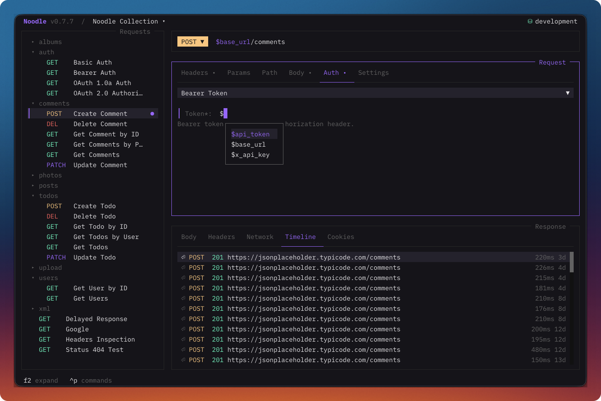
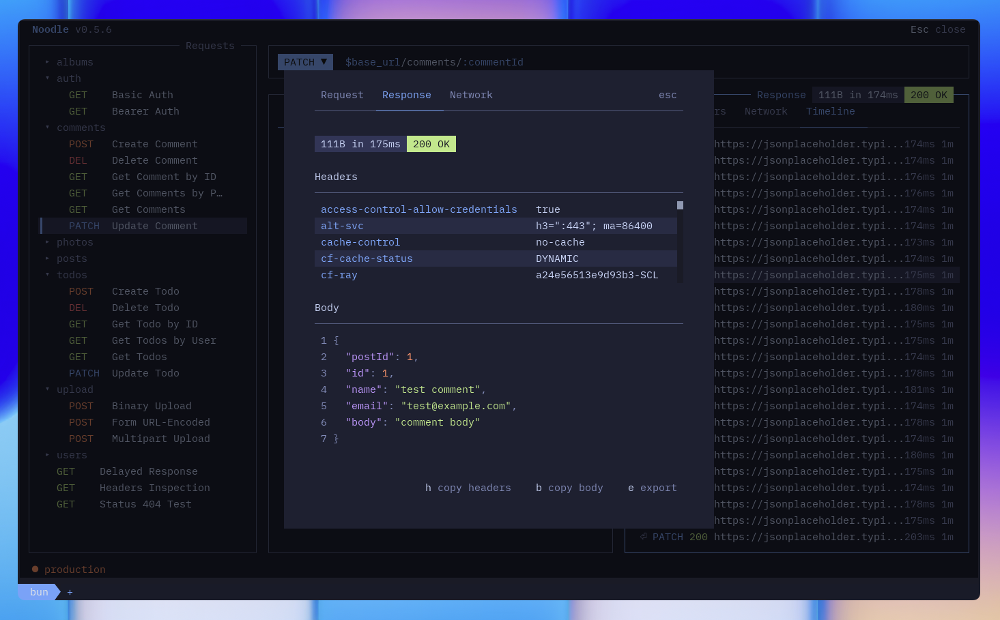
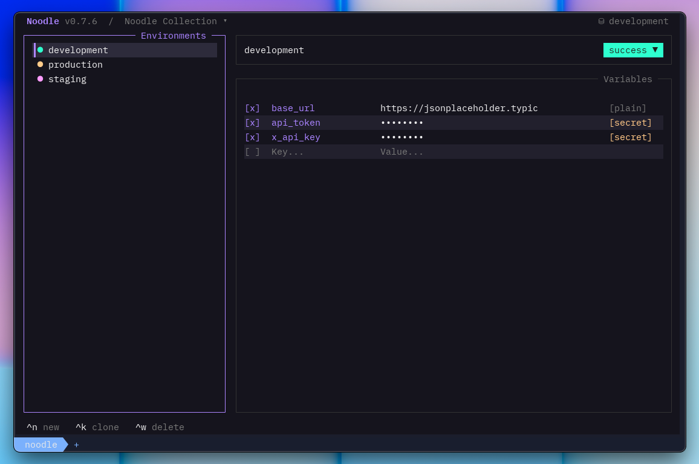

#  noodle

## Your API client should live with your code.

Noodle is a fast, keyboard-first HTTP client for the terminal. Requests stay as
readable YAML files in your repository. They are easy to review, share,
automate, and keep long after the tool is gone.

No cloud account. No workspace sync. No proprietary format.


<p align="center">
  <a href="https://noodlerest.dev/docs/getting-started/quick-start/"><strong>Get started</strong></a> ·
  <a href="https://noodlerest.dev/">Website</a> ·
  <a href="https://noodlerest.dev/docs/">Docs</a> ·
  <a href="https://github.com/wilfredinni/noodle/blob/main/CHANGELOG.md">Changelog</a> ·
  <a href="https://app.notion.com/p/39128d9edba9809da834f351332baf57?v=39228d9edba98042ad07000cdbe5d751&source=copy_link">Roadmap</a>
</p>

## API work without the workspace gravity

Most API clients want to become the place your work lives. Noodle takes the
opposite approach: your repository is the source of truth.

- **Requests you can read.** One small `.yml` file per request. Diff it, review
  it, copy it, or edit it with any text editor.
- **A workflow that travels.** Open the same collection in the TUI, run it from
  the CLI, or hand it to an agent without translating it first.
- **Your data stays yours.** Noodle works from local files and stores declared
  secrets in your operating system's credential vault.
- **No clean-slate migration.** Bring in OpenAPI, Swagger, Postman, or Insomnia
  collections and export to OpenAPI or Postman when you need to leave.

## From first request to repeatable workflow

Install Noodle:

```bash
curl -LsSf https://noodlerest.dev/install.sh | sh
```

Create a collection and make your first request:

```bash
noodle collection create my-api
noodle request create users/get \
  --url https://api.example.com/users/42 \
  --collection ./my-api
noodle --collection ./my-api
```

What you edit in the terminal is simply a file:

```yaml
name: Get User
method: GET
url: $base_url/users/:userId
path_params:
  - name: userId
    value: $user_id
headers:
  Accept: application/json
```

Commit it beside the code it exercises. Teammates get the request, its folder
structure, and its shared configuration through the same workflow they already
use for everything else.

Prefer Homebrew?

```bash
brew tap wilfredinni/noodle
brew trust wilfredinni/noodle
brew install noodle
```

[See every installation option →](https://noodlerest.dev/docs/getting-started/installation/)

## Made for the whole API loop

### Explore without leaving the terminal

Edit URLs, parameters, headers, authentication, and bodies inline. Jump between
panes from the keyboard, switch environments in a keystroke, search large
collections, and choose from more than 30 themes.



### See what actually happened

Inspect formatted bodies and headers, filter JSON with JSONPath, follow the
network trace across redirects and proxies, and revisit previous responses in
the per-request timeline.



### Share configuration, not secrets

Use environment variables for development, staging, and production. Mark
sensitive values as secrets and Noodle keeps them out of environment files,
request history, generated code, search results, and exports.



### OAuth 1.0a and OAuth 2.0

OAuth is first-class request and folder authentication. Keep credentials in
environment secrets and reference them with `$VARNAME`; generated OAuth 2
state, PKCE verifiers, authorization codes, and cached tokens are never written
to request YAML.

OAuth 1.0a supports HMAC, RSA, and PLAINTEXT signatures plus header, query, or
URL-encoded body placement. OAuth 2.0 supports authorization code, client
credentials, implicit, and password grants.

Authorization code uses S256 PKCE by default. Browser flows run only in the TUI,
and OAuth 2 token responses are stored in the operating system credential vault
with a session-only memory fallback. Select an OAuth 2 request and open the
command palette to fetch or authorize, copy, or clear its token.

[Read the authentication guide](https://noodlerest.dev/docs/guides/authentication/)
for setup and security guidance, or see the
[collection format reference](https://noodlerest.dev/docs/reference/collection-format/#oauth-20)
for every supported field.

### Automate the work you already explored

Every collection can be inspected, audited, formatted, and run without opening
the TUI. Commands support structured JSON output, so the same requests work in
scripts, CI, and agent workflows.

```bash
noodle request run users/get --collection ./my-api --env staging
noodle collection audit ./my-api --json
noodle collection run ./my-api --json
```

Noodle keeps one cookie jar per collection. Inspect it with
`noodle cookie list --collection ./my-api`; JSON output includes the storage
state, any non-fatal warnings, and each cookie's host-only scope. If the OS
credential vault is unavailable, Noodle uses a mode-`0600` plaintext file and
reports a persistent warning. Unreadable or corrupt storage is never replaced
automatically: requests continue without jar cookies, and an explicit
`noodle cookie clear --collection ./my-api` preserves the original as a backup
before resetting the jar.

On Linux, Noodle uses Secret Service through GNOME Keyring or KWallet. Desktop
sessions normally start and unlock the provider; headless sessions need a user
D-Bus session and an unlocked keyring. See the [Linux secret storage setup](https://noodlerest.dev/docs/reference/environment-format/#linux-and-headless-environments)
guide if `noodle secret set` reports that the `login` keyring collection is
unavailable.

[Explore the CLI →](https://noodlerest.dev/docs/getting-started/cli/)

## Bring your existing work

Import an OpenAPI 3.0 or Swagger 2.0 specification, a Postman collection, or an
Insomnia export:

```bash
noodle import ./specs/api.yaml --output ./collections
```

You can also export a collection to OpenAPI or Postman, so adopting Noodle is a
choice, not a trap.

[Learn about imports and exports →](https://noodlerest.dev/docs/)

## Built for people and agents who work in repositories

Because Noodle collections are plain files with a non-interactive CLI, coding
agents can create, organize, audit, and run them without screen scraping or a
hosted integration.

Install the `noodle-use` skill:

```bash
npx skills add wilfredinni/noodle --skill noodle-use -g
```

Then ask your agent to:

- “Scaffold a Noodle collection for this API.”
- “Audit these requests for security issues and REST best practices.”
- “Convert this Insomnia export into a Noodle collection.”

[Use Noodle with AI agents →](https://noodlerest.dev/docs/guides/ai-agent-skills/)

## Dive deeper

- [Quick start](https://noodlerest.dev/docs/getting-started/quick-start/)
- [Documentation](https://noodlerest.dev/docs/)
- [CLI reference](https://noodlerest.dev/docs/getting-started/cli/)
- [Changelog](CHANGELOG.md)
- [Security policy](SECURITY.md)

## Contributing

Noodle is built with Bun, TypeScript, React, and OpenTUI. To run it locally:

```bash
bun install
bun run dev -- --collection ./collections --env development
```

See [AGENTS.md](AGENTS.md) for the architecture, conventions, and test commands.

Apache-2.0 licensed.
