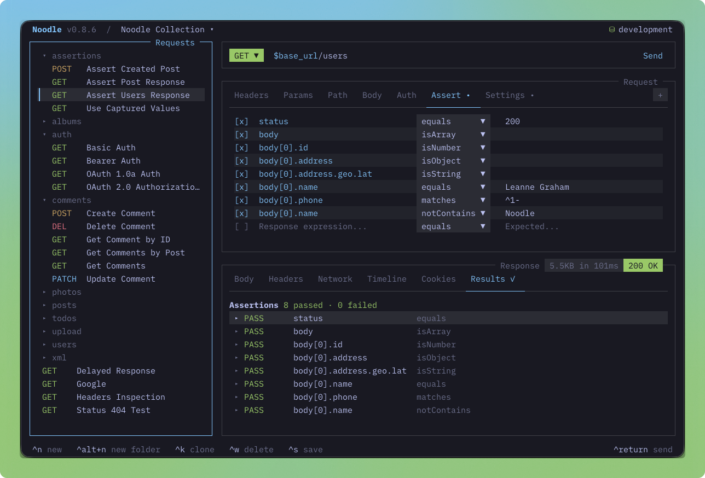

#  noodle

## Readable requests. Versioned workflows. No lock-in.

Noodle is a terminal HTTP client that keeps requests as readable YAML files in
your repository. Write, send, inspect, and automate API requests without a
database, cloud account, or proprietary format.



<p align="center">
  <a href="https://noodlerest.dev/">Website</a> ·
  <a href="https://noodlerest.dev/docs/getting-started/quick-start/">Quick Start</a> ·
  <a href="https://noodlerest.dev/docs/">Docs</a> ·
  <a href="https://github.com/wilfredinni/noodle/blob/main/CHANGELOG.md">Changelog</a> ·
  <a href="https://app.notion.com/p/39128d9edba9809da834f351332baf57?v=39228d9edba98042ad07000cdbe5d751&source=copy_link">Roadmap</a>
</p>

## Why Noodle

- **Keep requests in files you own.** One `.yml` file per request makes API
  work easy to review, share, and version with Git.
- **Keep shared context beside code.** Folders provide inheritable headers and
  auth; environments resolve `$variables` for development, staging, and
  production.
- **Work interactively or automate confidently.** Use the terminal UI for
  everyday exploration, then run, audit, and manage collections from scripts
  or agent workflows.

## Get started

### Install

```bash
curl -LsSf https://noodlerest.dev/install.sh | sh
```

Or install with Homebrew:

```bash
brew tap wilfredinni/noodle
brew trust wilfredinni/noodle
brew install noodle
```

The curl installer places the binary in `~/.local/bin/noodle` and verifies the
release SHA-256 checksum before replacing an existing binary. See the
[installation guide](https://noodlerest.dev/docs/getting-started/installation/)
for supported platforms and source builds.

### Create and send a request

```bash
noodle collection create my-api
noodle request create users/get --url https://api.example.com/users/42 --collection ./my-api
noodle request run users/get --collection ./my-api
```

Open the same collection in the TUI whenever you want to edit and inspect it:

```bash
noodle --collection ./my-api
```

## A request is just YAML

```yaml
name: Get User
method: GET
url: $base_url/users/:userId
path_params:
  - name: userId
    value: $user_id
headers:
  Accept: application/json
```

Use `$variables` from an environment file, keep required URL segments in
`path_params`, and commit the request with the rest of your project. Noodle
supports headers, query parameters, JSON, form, multipart, and binary bodies,
plus bearer, basic, and API-key authentication.

## Features

### Create and organize requests

- One Git-friendly YAML file per request, with direct YAML editing when you
  need it.
- Inline editing for URLs, headers, query and path parameters, bodies,
  authentication, and request settings.
- JSON, form, multipart, and binary request bodies, plus bearer, basic, and
  API-key authentication.
- Folders with inheritable headers and authentication, alongside environments
  with `$variable` substitution and a built-in editor.

### Inspect and iterate

- Formatted response bodies, headers, clipboard copy, and JSONPath filtering.
- Live network traces for requests, redirects, responses, and failures.
- Per-request response history with a timeline for revisiting prior work.
- Fuzzy request and folder search, and a side-by-side or stacked layout.

### Make the terminal yours

- More than 30 built-in themes and customizable keybindings.
- Keyboard-first navigation, jump mode, and mouse controls including sidebar
  context menus.

### Bring in and run existing work

- OpenAPI 3.0, Swagger 2.0, and Postman collection imports.
- A non-interactive CLI for collection inspection, validation, request runs,
  and agent workflows.

## Import an existing collection

Bring an OpenAPI 3.0/Swagger 2.0 specification or Postman collection into Noodle:

```bash
noodle import ./specs/api.yaml --output ./collections
```

Noodle detects the supported format automatically. Use `--format openapi`,
`--format swagger`, or `--format postman` when you need to choose explicitly. Imported valid JSON
request bodies are pretty-printed automatically.

## Automation CLI

`noodle` without a subcommand opens the interactive TUI. The commands below
are non-interactive and support `--json`, which emits one
`{ status, data, errors }` envelope for scripts and agents.

| Command                                                                | Use it to                                                |
| ---------------------------------------------------------------------- | -------------------------------------------------------- |
| `noodle workspace list`                                                | List registered collections.                             |
| `noodle collection create <name>`                                      | Create and register a collection.                        |
| `noodle collection inspect <path>`                                     | Inspect a collection's tree, metadata, and environments. |
| `noodle collection format <path>`                                      | Canonicalize request YAML and pretty-print JSON bodies.   |
| `noodle collection audit <path>`                                       | Validate collection files.                               |
| `noodle collection run <path>`                                         | Run every request in a collection.                       |
| `noodle request create <id> --url <url> --collection <dir>`            | Create a minimal request.                                |
| `noodle request run <id> --collection <dir>`                           | Run one request.                                         |
| `noodle environment set <key> <value> --env <name> --collection <dir>` | Set an environment value.                                |

Run commands accept `--env <name>` when you want to override the collection's
default environment. Request IDs are collection-relative paths without `.yml`,
such as `users/get`.

For all commands, path rules, and JSON output details, see the
[CLI reference](https://noodlerest.dev/docs/getting-started/cli/).

## Use with AI agents

Install the `noodle-use` skill to teach supported coding agents how to create,
organize, audit, import, and automate Noodle collections.

```bash
npx skills add wilfredinni/noodle --skill noodle-use -g
```

Try prompts such as:

- “Scaffold a Noodle collection for the Stripe API with authentication and a few endpoints.”
- “Audit this collection for security issues and REST best practices.”
- “Convert this Insomnia export to a Noodle collection.”

Read the [AI agent skills guide](https://noodlerest.dev/docs/guides/ai-agent-skills/)
for supported workflows and examples.

## Updating

```bash
noodle update
```

Standalone installs use Noodle's update manifest and verify the matching
binary's SHA-256 checksum before replacement. Update checks are cached for one
hour; use `noodle update --force` to check immediately. Homebrew installs run
`brew upgrade noodle`.

## Development

```bash
bun install
bun run dev -- --collection ./collections --env development
bun test
bun run lint
bun run typecheck
bunx prettier --check ./src ./tests
```

`bun install` also enables the project's Git hooks. The pre-commit hook formats
and lints staged source and test files; the pre-push hook runs type checking
and the full test suite.

See [AGENTS.md](AGENTS.md) for architecture, conventions, testing guidance,
and release commands.
