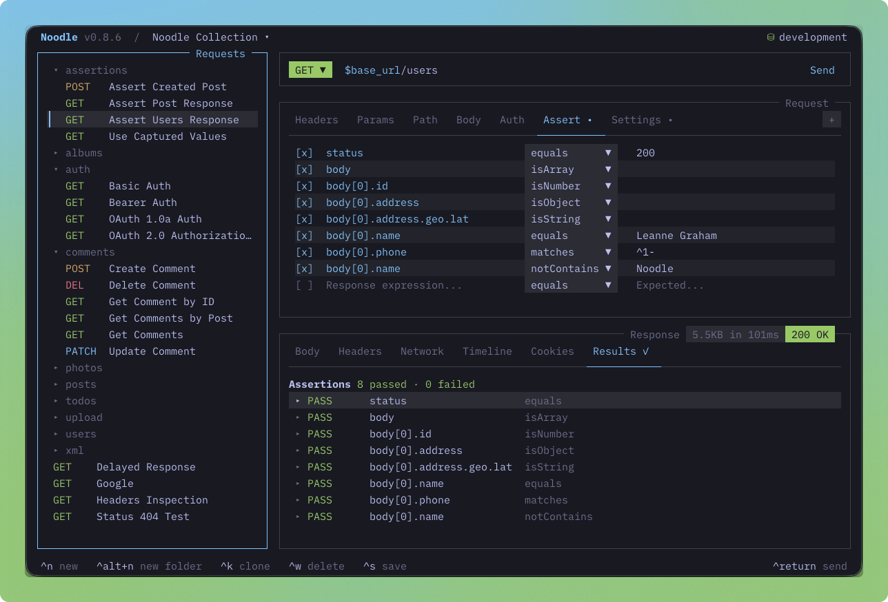

<h1 align="center">Noodle</h1>

<p align="center"><strong>API workflows, <em>untangled.</em></strong></p>

<p align="center">Open-source terminal REST client</p>

<p align="center">
  Write, send, inspect, and automate HTTP requests from readable files without
  leaving your terminal. Keep every collection versioned beside the code it
  exercises, ready for the TUI, CLI, scripts, and coding agents.
</p>

<p align="center">
  <a href="https://noodlerest.dev/docs/getting-started/quick-start/"><strong>Get started</strong></a> ·
  <a href="https://noodlerest.dev/">Website</a> ·
  <a href="https://noodlerest.dev/docs/">Docs</a> ·
  <a href="CHANGELOG.md">Changelog</a> ·
  <a href="SECURITY.md">Security</a> ·
  <a href="https://github.com/sponsors/wilfredinni">Sponsor</a>
</p>



## Install

```bash
curl -LsSf https://noodlerest.dev/install.sh | sh
```

Prebuilt binaries support macOS and Linux on arm64 and x86_64, plus Windows x64
in beta.
See [installation options](https://noodlerest.dev/docs/getting-started/installation/)
for Homebrew and source builds.

### Windows x64 (beta)

Windows x64 binaries are included from v0.9.7. Install from PowerShell:

```powershell
irm https://noodlerest.dev/install.ps1 | iex
```

The installer verifies the release checksum, installs to
`%LOCALAPPDATA%\Programs\Noodle\noodle.exe`, and updates your user PATH.
Open a new terminal after installation. Windows ARM64 is not supported.
Set `NOODLE_VERSION`, `NOODLE_INSTALL_DIR`, or `NOODLE_SKIP_PATH_UPDATE=1`
before running the script to override the version, destination, or PATH update.

Run `noodle update` to stage an update, then close and reopen Noodle to apply it.
Windows executables are unsigned; browser downloads may trigger Windows trust
prompts. Ordinary-account and interactive terminal testing remains pending.
For prerelease testing, manually dispatched CI runs provide a Windows beta ZIP
containing `noodle.exe`, checksums, and build information.

## Quick start

Follow the [quick start guide](https://noodlerest.dev/docs/getting-started/quick-start/)
to create a collection, send your first request, and inspect the response.

## Features

- 📁 **[File-based collections](https://noodlerest.dev/docs/guides/collections/):**
  Keep requests in YAML, organize them into folders, and version them with Git.
- ✏️ **[Request editor](https://noodlerest.dev/docs/guides/using-the-request-pane/):**
  Edit URLs, parameters, headers, JSON, XML, forms, and file uploads in the terminal.
- 🔍 **[Response inspection](https://noodlerest.dev/docs/guides/using-the-response-pane/):**
  Explore JSON and XML in Source or Visual views, filter JSON with JSONPath,
  and inspect headers and network traces.
- 📥 **[Images and downloads](https://noodlerest.dev/docs/guides/using-the-response-pane/#images-and-binary-responses):**
  Preview supported images, save response files, and open them in their default app.
- 🗝️ **[Environments and secrets](https://noodlerest.dev/docs/guides/using-environments/):**
  Switch between environments, reuse variables, and store secrets in the OS vault.
- 🔐 **[Authentication](https://noodlerest.dev/docs/guides/authentication/):**
  Use bearer tokens, basic auth, API keys, OAuth 1.0a, OAuth 2.0, NTLMv2, and AWS SigV4.
- 🛡️ **[Proxies and TLS](https://noodlerest.dev/docs/guides/settings/):**
  Configure proxy policies, custom certificate authorities, and mutual TLS.
- 🧪 **[Response assertions](https://noodlerest.dev/docs/guides/automation/#put-success-criteria-beside-the-request):**
  Check status, timing, headers, and JSON values in the TUI or CI.
- ✅ **[Scripted tests](https://noodlerest.dev/docs/guides/scripted-tests/):**
  Check responses with synchronous or async tests, JSON Schema draft-07,
  property, length, type, and partial-object matchers.
- 🎯 **[Response captures](https://noodlerest.dev/docs/guides/automation/#pass-response-values-forward):**
  Pass response values to later requests or save them to an environment or secret.
- 📜 **[Scripting](https://noodlerest.dev/docs/guides/pre-request-scripting/):**
  Prepare requests and process responses with sandboxed JavaScript.
  Share inline scripts or external JavaScript files across collections and folders.
  Pre scripts, post scripts, and tests each run collection → folders → request,
  so request-specific successful writes override inherited values.
  Author Pre Script, Post Script, and Tests in the TUI with completion, diagnostics,
  folding, and formatting; browse logs in Console.
- 🎲 **[Body templates](https://noodlerest.dev/docs/guides/using-the-request-pane/#random-and-time-body-values):**
  Generate test data and timestamps with `$random` and `$time` placeholders.
- ⚡ **[Collection runner and automation](https://noodlerest.dev/docs/guides/automation/):**
  Run requests or folders with tag filters, fail-fast behavior, delays, CSV/JSON
  iteration data, and JSON results. Try the [data-run example](collections/scripting-data).
- 🕘 **[Response history](https://noodlerest.dev/docs/reference/timeline/) and
  [cookies](https://noodlerest.dev/docs/guides/settings/#general):**
  Revisit past responses and manage a cookie jar for each collection.
- 🎨 **[Themes](https://noodlerest.dev/docs/reference/theming/) and
  [keybindings](https://noodlerest.dev/docs/reference/keybindings/):**
  Follow your terminal palette or choose a theme, and customize your shortcuts.
- 🔄 **[Import](https://noodlerest.dev/docs/import/import/) and
  [export](https://noodlerest.dev/docs/import/export/):**
  Bring OpenAPI, Swagger, Postman, and Insomnia collections into Noodle;
  preserve compatible Postman and Insomnia scripts without translating foreign APIs.
  Imports that retain scripts or tests require a new collection.
  Export to OpenAPI or Postman.
- 🤖 **[AI agent skills](https://noodlerest.dev/docs/guides/ai-agent-skills/):**
  Install the Noodle skill with `noodle agent install` so coding agents can
  create, maintain, and run collections.

## Documentation

- [All guides and references](https://noodlerest.dev/docs/)
- [CLI commands](https://noodlerest.dev/docs/getting-started/cli/)
- [Collection format](https://noodlerest.dev/docs/reference/collection-format/)
- [Script scopes and inheritance](https://noodlerest.dev/docs/guides/pre-request-scripting/#inherited-scripts-and-tests)
- [External JavaScript files](https://noodlerest.dev/docs/guides/pre-request-scripting/#external-javascript-files)
- [Script cookbook](https://noodlerest.dev/docs/guides/script-cookbook/)
- [Changelog](CHANGELOG.md)

## Contributing

Noodle is built with Bun, TypeScript, React, and OpenTUI.

```bash
bun install
bun run dev -- --collection ./collections --env development
```

See [AGENTS.md](AGENTS.md) for the architecture, conventions, and test commands.

## Sponsor

Noodle is free and open source. If it saves you time, you can
[sponsor its continued development](https://github.com/sponsors/wilfredinni).
Sponsorship supports maintenance, bug fixes, documentation, and platform testing.

## License

[Apache-2.0](LICENSE).
